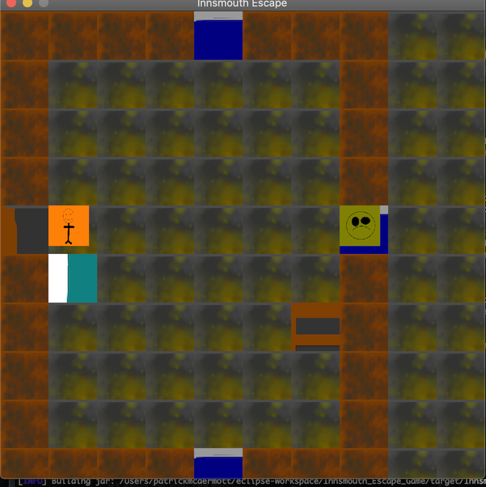

## Overview

Sprite game that  consists of 3 rooms. I originally made this as a class project
and have since chipped away at reworking it.
I made the titles myself in PaintX. The tiles came out ok but sorry about the bad graphics on the sprites.
I was focused on the game logic. At some point I will upgrade the sprites.  

## How to run

cd into the project directory and run 
mvn clean package 
java -jar target/Innsmouth_Escape_Game-0.0.1-SNAPSHOT.jar

## Gameplay

Game begins on the title screen. You can toggle to gameplay with esc.
Arrow keys control the Sprite. You begin in the south room and can explore the
middle and north rooms. Winning is not implemented yet but touching the green enemy sprite will end the game and bring you to the Game Over screen.

